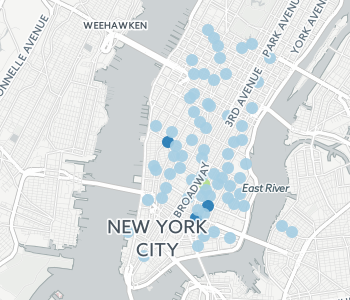
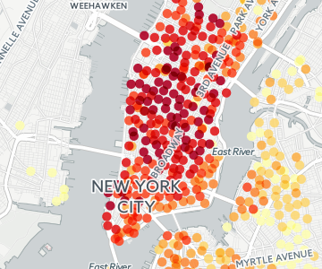
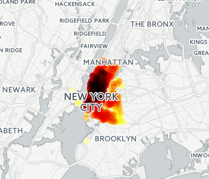
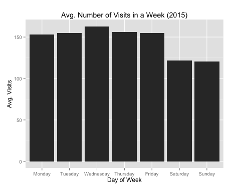
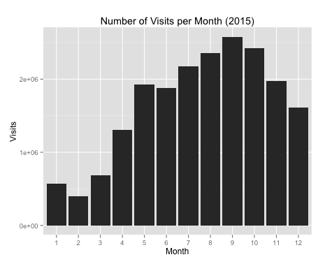
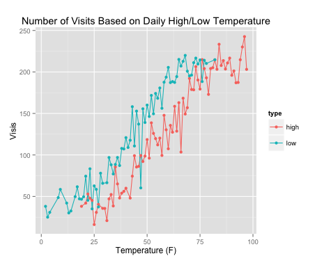
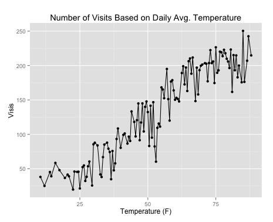
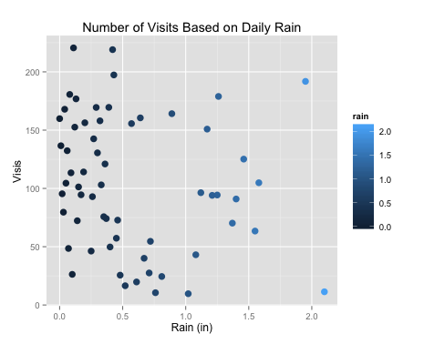
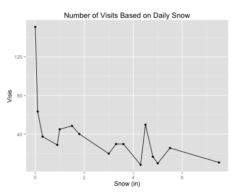

CitiBot
==============
CitiBot is an on-demand marketplace framework for NYC's Citi Bike system. It uses machine learning algorithms to predict usage demand of each Citi Bike station and request maintenance based on accumulated usage from service providers to optimize:
* number of stations in service 
* cost of Citi Bike maintenance
* profit of service providers 

The goal of CitiBot is to experiment combining static, dynamic and contextual data streams around usage to create an on-demand marketplace that is automated, efficient and maximizes service levels for both buyers and sellers. If our initial hypothesis and framework prove to be valid and sustainable. The concept and workflow could possibly be generalized to other business sectors.

On-demand Marketplace
---------------------
In an on-demand marketplace such as AWS, Uber, GrubHub, etc., there are typically three main characters, and they each map to one in our bikeshare on-demand marketplace:
* service consumer - bikes & stations
* service provider - bike & staion mainteance companies
* resourced being consumed - bike & station usage

Visualize Station Visits with CartoDB
---------------------------------
Visits~Date/time in Feb. 2015

Visits for each station in 2015

Number of checkouts for each station in 2015

Number of returns for each station in 2015

Graphs
-------

